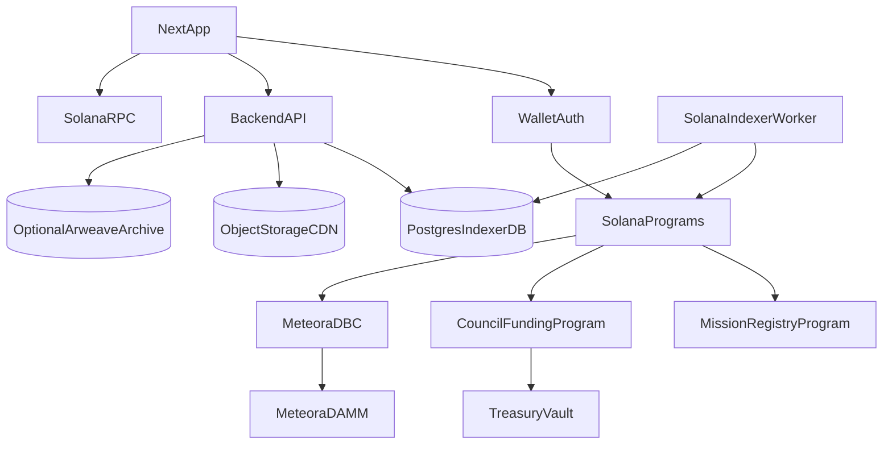

# Singularity Backend Specification

This document defines the backend and Solana implementation plan for the Singularity platform. It is intended to pair with `UI_SPECIFICATION.md` and turn the current clickable mock app into a production architecture for mission markets, mission tokens, treasury councils, funding requests, and wallet-based profiles.

The current app in `apps/app` uses local mock data only. This spec defines the first real backend boundary: what should be executed on Solana, what should be indexed for fast reads, what should live in permanent metadata storage, and what should remain editable in the application database.

## Product Backend Goals

Singularity should feel like a crypto-native fundraising terminal while relying on as many audited and open-source Solana components as possible.

Primary goals:

- Let a user connect with any major Solana wallet and use the app as their identity.
- Let a creator launch a mission with a mission token and a primary market.
- Sell mission tokens through a bonding curve before graduation.
- Graduate successful mission markets into an AMM with real liquidity.
- Reserve 20% of token supply for the mission treasury.
- Let the top 6 registered mission-token holders from each finalized checkpoint act as the treasury council.
- Let the council approve funding requests with a 4 of 6 threshold and a minimum 3 day voting period.
- Keep canonical financial and governance state verifiable on Solana.
- Keep the app fast through indexed reads and off-chain metadata.

Non-goals for the first production version:

- Do not write a custom bonding curve or AMM unless existing protocols cannot satisfy product constraints.
- Do not store all profile, mission, and request text directly on Solana.
- Do not build a full DAO framework from scratch.
- Do not make the frontend query raw Solana accounts for every page render.

## Recommended Architecture

Use a hybrid Solana backend:

- Existing audited/open-source protocols for markets, liquidity, wallets, and treasury custody where possible.
- Small custom Singularity programs only for product-specific rules that existing protocols do not express cleanly.
- A backend API and indexer for fast reads, denormalized feeds, search, charts, and profile pages.
- Postgres as the primary live database for app-facing metadata, profiles, feeds, search, charts, and denormalized on-chain state.
- Object storage plus CDN for images and attachments.
- Optional Arweave snapshots only when the product needs immutable public proof of launch-time metadata.



## Component Choices

### Bonding Curve

Recommended default: [Meteora Dynamic Bonding Curve](https://docs.meteora.ag/overview/products/dbc/what-is-dbc).

Why:

- Open-source program repository: [MeteoraAg/dynamic-bonding-curve](https://github.com/MeteoraAg/dynamic-bonding-curve).
- Permissionless Solana token launch protocol.
- Fully on-chain virtual pool during the bonding phase.
- Configurable multi-segment price curve.
- Supports SPL tokens and Token-2022, which makes Token-2022 compatible with the recommended Singularity launch path.
- Supports quote tokens including USDC.
- Built-in migration to Meteora DAMM v1 or DAMM v2 after a configured quote threshold.
- Supports creator, partner, protocol, and referral fee splits.
- Includes anti-sniper-style configuration options such as launch fee scheduling and rate-limiter style fees.

Singularity should not implement its own bonding curve for MVP. The product should wrap Meteora DBC with a Singularity launch flow and persist mission-specific metadata and treasury rules alongside the DBC pool.

### Token Standard

Recommended default: Token-2022 mission tokens.

Meteora DBC supports SPL tokens and Token-2022 launch flows that graduate to DAMM v1 or DAMM v2, but active Token-2022 extensions should not be assumed compatible. For MVP, use a conservative Token-2022 mint without active transfer hooks or transfer fees.

Use Token-2022 for newly launched mission tokens because it gives Singularity room to add token-level extensions later without changing the product standard. For MVP, keep the mint conservative:

- Use Token-2022 for the mission token mint.
- Do not enable active Token-2022 transfer hooks for MVP mission mints. Current Meteora/Jupiter compatibility is not strong enough for the default launch path.
- Put the treasury/council multisig logic around treasury vault transfers, not around every user-to-user token transfer.
- Treat backend/indexer-submitted candidate balance checkpoints, verified against passed token accounts by the governance program, as the source for council eligibility.
- Add Token-2022 extensions only after confirming each extension is supported by Meteora DBC, Meteora DAMM, Jupiter routing, wallet adapters, and the indexer.

This means users can freely buy, sell, and transfer mission tokens, while funding payouts from the mission treasury remain gated by the custom council program and its PDA-controlled treasury authority.

Compatibility rule:

- Do not make every Token-2022 mission token transfer require council approval.
- Do make treasury vault transfers require council approval.
- The council program should control the treasury authority and approve specific transfer instructions after the 4 of 6 voting rule is satisfied.
- If the treasury holds mission tokens, the approved payout is a Token-2022 transfer from the mission-token treasury vault.
- Normal user trading through Meteora DBC, Meteora DAMM, and Jupiter should stay permissionless.

Treasury allocation rule:

- USDC is the initial quote asset for buying mission tokens.
- The mission treasury is only the newly created mission token, equal to 20% of total mission token supply.
- Funding requests request mission tokens from the treasury. The UI may display a USD estimate using the current indexed token price, but the on-chain request amount is denominated in mission token base units.
- DBC quote reserves and AMM liquidity are separate market/liquidity state, not the mission treasury.

Open verification before mainnet:

- Confirm current audit reports and program upgrade authority status.
- Confirm DBC config requirements for USDC quote pools.
- Confirm exact migration keeper thresholds and whether manual migration is needed for lower-liquidity launches.
- Confirm whether fixed supply or dynamic supply best fits the 80/20 allocation model.

### AMM Graduation

Recommended default: Meteora DAMM v2.

Graduation behavior:

- During bonding, trades route to the Meteora DBC virtual pool.
- When the configured quote reserve threshold is reached, the pool graduates to a Meteora DAMM pool.
- After graduation, buy/sell UI should route through the AMM, preferably via Jupiter for best execution and wallet compatibility.
- The mission page should clearly show whether the market is in `Bonding` or `Graduated` state.

Key product decision:

- Use USDC as the quote asset at launch for clearer fundraising, market pricing, and funding request USD estimates.

### Trading Fee Rewards

Trading fee rewards should come from Meteora DBC and Meteora DAMM fees, not from Token-2022 transfer taxes.

Recommended fee source:

- Bonding phase: Meteora DBC partner/creator trading fee share.
- Graduated phase: Meteora DAMM v2 LP/position fees.
- Fee token: USDC whenever possible, using DBC quote-only fee collection and DAMM v2 `OnlyB` quote-token fee mode.
- Collection: claimed into a program-controlled `MissionRewardsVault`.

Fee distribution:

| Recipient | Share | Notes |
| --- | ---: | --- |
| Mission creator | 10% | Rewards mission creation and initial market setup. |
| Singularity platform | 20% | Funds platform operations, indexing, security, and maintenance. |
| Top 6 council members | 60% | Split between the finalized epoch council members. Default MVP split: equal 10% each. |
| Other registered candidates | 10% | Distributed pro-rata to eligible registered council candidates outside the top 6. |

Rules:

- No Token-2022 transfer fee for MVP. Normal mission token transfers and market trades should stay clean.
- Council rewards are based on finalized registered-candidate balance checkpoints, not arbitrary unregistered wallet balances.
- Council rewards accrue by epoch so users can understand what they earned and claim later.
- The UI should call this `Earned trading fees`, not only `Creator trading fees`, because creators, council members, and other lockers can all earn.
- The app can show creator, council, and registered candidate earnings as separate rows under the same profile section.

### Treasury Custody And Governance

There are three viable building blocks. The final production design may combine them.

#### Option A: Squads Protocol v4 For Treasury Custody

[Squads](https://docs.squads.so/main/getting-started/treasury-management-overview) is a production Solana multisig and smart account platform used by major Solana teams. Squads Protocol v4 is open source and documented as audited/formally verified by Squads.

Best fit:

- Custody of treasury assets.
- Multisig execution of treasury transfers.
- Operational safety, transaction history, permissioning, and spending controls.
- Fixed or periodically updated member sets.

Limitations for Singularity:

- The product rule is not just "6 known signers approve." It is "the current top 6 registered token holders from the finalized checkpoint are eligible, each gets equal council power, and 4 of 6 pass."
- If council membership changes frequently with token trading, Squads membership would need to be updated programmatically or through governance.
- Dynamic top-holder eligibility may be better handled by a custom program, with Squads used only as custody or not used for automated MVP execution.

#### Option B: Realms / SPL Governance

[Realms](https://realms.today/) and SPL Governance provide on-chain proposal workflows, voting, treasury management, and plugin-based voting power.

Best fit:

- DAO-style proposal workflows.
- Token-weighted or plugin-weighted governance.
- Public governance history and treasury proposals.

Limitations for Singularity:

- Product copy says the top 6 registered holders form a council, but the council votes equally. That is not the default token-weighted DAO model.
- A custom voter-weight plugin may be needed to express top-6-only, one-seat-one-vote behavior.
- The UX may become heavier than the product needs if every mission becomes a full DAO.

#### Option C: Custom Singularity Council Program

Recommended MVP path for robust product behavior.

Build a small Anchor program that manages funding requests and council votes. This program should not reinvent token custody, token swaps, or AMM logic. It should only encode Singularity's product-specific governance rules.

Core rules:

- Each mission has a treasury vault or treasury authority.
- A funding request includes recipient, requested amount, optional metadata/content hash, created timestamp, voting deadline, status, approvals, and rejections.
- Council eligibility is based on registered council candidates whose mission-token balances are submitted by the backend/indexer at epoch checkpoints and verified on-chain against provided token accounts.
- Top 6 eligible registered candidates each have 1 council vote.
- A request passes when at least 4 distinct council members approve.
- Voting remains open for at least 3 days unless a stricter rule is selected.
- A council member must temporarily escrow their voting tokens when they vote; escrow unlocks after the request resolves.
- Execution transfers approved mission tokens from the treasury to the recipient after the minimum voting period and threshold are satisfied.

Recommended nuance:

- Users who want council power register as council candidates.
- Candidate tokens remain liquid until the candidate votes on a funding request.
- The backend/indexer observes registered candidate token accounts and submits an epoch checkpoint containing the top eligible candidates, token accounts, and observed balances.
- Council membership updates at fixed epochs from backend-submitted checkpoints that the on-chain program verifies against the token accounts included in the finalization transaction.
- Funding requests use the current finalized epoch council. That council cannot change while the request is active.
- Store the epoch council signer addresses, token accounts, balance checkpoint, and checkpoint slot on-chain for verifiability.

Important Solana constraint:

- A Solana program cannot scan the whole chain or ask the Token-2022 program for "the largest holders" by itself.
- Programs can only read accounts passed into the transaction, plus data already stored in their own accounts.
- Cross-program invocation can call another program with provided accounts, but it cannot perform a global query over all token accounts.
- Therefore, the program should not try to discover every liquid token holder. It should track only registered council candidates, because the candidate registry is bounded and opt-in.

Recommended checkpoint candidate registry design:

1. Investor buys mission tokens normally through Meteora DBC/DAMM/Jupiter.
2. Investor opts into governance by registering as a council candidate.
3. Registration creates a `CouncilCandidate` account and one or more registered token-account records for that wallet.
4. The backend/indexer tracks balances for registered candidate token accounts from token-account state and token-transfer history.
5. Tokens remain liquid while the candidate is only registered.
6. At each council epoch, the backend prepares a `finalize_epoch_council` transaction with the proposed top 6 registered candidates, their registered token accounts, and checkpoint balances.
7. The governance program verifies every provided token account belongs to the candidate owner, uses the mission mint, and has at least the submitted checkpoint balance at finalization time.
8. The governance program verifies the submitted list is ordered by eligible checkpoint balance and stores the finalized six wallets, candidate accounts, token accounts, balances, and checkpoint slot in `EpochCouncil`.
9. The UI shows the latest top 6 registered council candidates from on-chain epoch council state plus indexed display data.
10. Funding requests created during an epoch use that epoch's frozen top 6 council.
11. When a council member votes, they must temporarily escrow the voting amount backing their council seat.
12. Escrowed voting tokens unlock after the request is executed, rejected, or expired.
13. Treasury payout can execute only after the vote threshold and minimum voting period are satisfied.

Checkpoint trust requirement:

- The backend/indexer can propose the top 6, but the on-chain program must verify the balances of all candidate token accounts included in the checkpoint transaction.
- Because the program cannot globally prove that no omitted registered candidate has a higher balance, the backend/indexer must publish checkpoint inputs, raw observations, and transaction signatures for auditability.
- If stronger trust minimization is required, add a challenge window where anyone can present a registered candidate token account with a higher verified balance before epoch finalization becomes usable for new funding requests.

### Council Design Alternatives

The checkpoint candidate registry is the recommended MVP design because it preserves normal Meteora/Jupiter trading compatibility while keeping council candidates opt-in and bounded. Other versions are possible:

| Version | UX | Security | Notes |
| --- | --- | --- | --- |
| Liquid top 6 snapshot | Best UX for passive holders | Weak | Vulnerable to fast buy/request/sell capture and backend/indexer trust. |
| Checkpoint candidate registry + vote escrow | Best MVP fit | Medium | Registered candidates stay liquid until they vote; backend submits top 6 checkpoint and the program verifies provided token accounts. |
| Checkpoint registry plus challenge window | Medium | Stronger | Anyone can challenge a false top 6 by presenting a higher-balance registered candidate token account, but it adds waiting time. |
| Top 6 locked escrow | Good | Strong | Users choose to become council candidates by locking tokens. Safer fallback if checkpoint trust is unacceptable. |
| Transfer-hook candidate registry + vote escrow | Best UX if supported | Strong | Not recommended for MVP because active hooks are not compatible enough with Meteora/Jupiter routing. |
| Token-weighted voting by registered candidates | Medium | Strong | More DAO-like and less aligned with the 6-person council UI. |
| Reputation plus locked tokens | Medium | Stronger but subjective | Could require mission activity or identity signals, but adds product complexity and centralization. |

Recommended MVP:

- Use top 6 registered council candidates from backend/indexer-submitted balance checkpoints verified against candidate token accounts.
- Require temporary vote escrow for council members who vote on a funding request.
- Unlock vote escrow after the request executes, is rejected, or expires.
- Use 7 day council epochs.
- Use 4 of 6 approvals.
- Use 3 day minimum voting period.
- Let registered candidates buy/sell liquid mission tokens normally until they vote, with council eligibility fixed only at epoch checkpoints.
- Make the UI label explicit: `Top 6 registered mission-token investors form the treasury council`.

## On-Chain Program Strategy

Use Anchor for Singularity-specific Solana programs.

### Mission Registry Program

Purpose:

- Connect a Singularity mission to its token mint, DBC pool, treasury vault, optional metadata/content hash, and lifecycle state.

Likely accounts:

- `PlatformConfig`: global admin, fee receiver, accepted quote mints, program version.
- `Mission`: mission id, creator, token mint, optional metadata/content hash, DBC pool, treasury vault, state, timestamps.
- `MissionTreasury`: mission token treasury vault, treasury authority PDA, supply allocation.
- `CouncilConfig`: mission, candidate settings, vote escrow settings, epoch length, council size, approval threshold.
- `CouncilCandidate`: registered candidate wallet, registered token accounts, latest checkpoint balance, status.
- `EpochCouncil`: mission, epoch number, top 6 registered candidates, checkpoint balances and token accounts.

The Mission account should store compact canonical fields, not long descriptions or images.

### Council Funding Program

Purpose:

- Create, vote on, and execute funding requests from a mission treasury.

Likely accounts:

- `FundingRequest`: mission, requester, recipient, requested mission token amount, optional metadata/content hash, epoch council, created_at, voting_ends_at, status.
- `CouncilVote`: request, voter, vote, timestamp.
- `ExecutionReceipt`: request, executed_by, transfer signature or instruction result, timestamp.

Execution model:

- The program verifies threshold and timing.
- The program signs for a PDA-controlled Token-2022 mission token treasury vault.
- For MVP, execution can be manually triggered by any caller after threshold and timing rules are satisfied.
- Later, "automatic execution" means a backend keeper/crank submits the execution transaction as soon as the request becomes executable. Solana programs do not wake themselves up without a transaction.

### Custom Treasury Vault Design

MVP treasury custody should avoid Squads and use a Singularity-owned PDA treasury.

Vault model:

- Each mission has a `MissionTreasury` PDA derived from seeds such as `["mission_treasury", mission]`.
- The mission token treasury account is a Token-2022 token account for the mission mint, owned by a treasury authority PDA.
- At launch, 20% of total mission token supply is minted or transferred into this treasury token account.
- No user wallet, creator wallet, or backend hot wallet can directly sign treasury transfers.
- The council funding program is the only authority that can sign a treasury transfer through PDA seeds.

Payout model:

1. A funding request stores recipient wallet, recipient mission-token account, requested mission-token amount, mission mint, and epoch council.
2. Council members vote against the frozen epoch council.
3. After 4 of 6 approvals and the minimum voting period, execution transfers mission tokens from the treasury token account to the recipient token account.
4. If the recipient does not have a token account, the transaction can create the associated Token-2022 token account before transfer.
5. The request status becomes `executed` and cannot execute again.

This design keeps treasury custody on-chain and programmatic without requiring Squads for MVP.

### Integration With Meteora DBC

The launch flow should create or reference:

- Token mint.
- Metaplex token metadata.
- Meteora DBC config or selected platform config.
- Meteora DBC virtual pool.
- Singularity Mission account.
- Mission token treasury vault account.

The exact instruction composition depends on Meteora SDK constraints. The app should present this as one launch flow, but implementation may require multiple wallet approvals or a backend-prepared transaction.

## Contract Specification

Singularity should use external audited programs for market mechanics and custom programs only for mission registry, immutable request state, council voting, and treasury access control.

### External Programs

External programs used by the product:

- Token-2022 Program: mission token mint, user token accounts, and mission treasury token account.
- Metaplex Token Metadata: token name, symbol, image URI, and metadata URI.
- Meteora DBC: bonding curve launch market.
- Meteora DAMM v2: post-graduation AMM.
- Associated Token Account Program: recipient and treasury token accounts.
- System Program and Rent Sysvar: account creation and rent handling.

### Custom Programs

MVP custom programs:

- `singularity_registry`: owns platform configuration, mission registry accounts, mission metadata hash, token mint references, Meteora pool references, and treasury references.
- `singularity_council`: owns council candidate registry accounts, vote escrow accounts, finalized epoch council accounts, funding request accounts, votes, execution receipts, treasury transfer authority, and trading-fee reward distribution state.

These can be two programs for cleaner ownership boundaries, or one Anchor workspace with two programs. The important rule is that market trading remains external and permissionless, while treasury access is controlled only by Singularity's council logic.

### PDA Authority Model

Treasury access is controlled by PDAs, not by a human signer, creator wallet, backend wallet, or Squads account.

Recommended PDA seeds:

```text
platform_config       = ["platform_config"]
mission               = ["mission", mission_slug_or_id]
mission_treasury      = ["mission_treasury", mission]
treasury_authority    = ["treasury_authority", mission]
council_candidate     = ["council_candidate", mission, owner]
candidate_token       = ["candidate_token", council_candidate, token_account]
balance_checkpoint    = ["balance_checkpoint", mission, epoch_number]
vote_escrow           = ["vote_escrow", funding_request, voter]
vote_escrow_token     = ["vote_escrow_token", vote_escrow]
epoch_council         = ["epoch_council", mission, epoch_number]
funding_request       = ["funding_request", mission, request_id]
council_vote          = ["council_vote", funding_request, voter]
execution_receipt     = ["execution_receipt", funding_request]
mission_rewards_vault = ["mission_rewards_vault", mission]
reward_epoch          = ["reward_epoch", mission, epoch_number]
reward_claim          = ["reward_claim", reward_epoch, wallet]
```

The Token-2022 mission treasury token account should have:

- `mint`: the mission token mint.
- `owner`: the `treasury_authority` PDA.
- `close_authority`: none, or the same PDA if closure is ever needed after a formal terminal state.
- `delegate`: none.

No externally owned account should be able to transfer from the treasury. The only valid treasury movement is a Token-2022 transfer signed by the `treasury_authority` PDA during the `execute_funding_request` instruction.

### `singularity_registry` Accounts

`PlatformConfig`:

- `admin_multisig`: upgrade/admin wallet, ideally a multisig even if not Squads custody.
- `fee_receiver`: platform fee destination if used.
- `accepted_quote_mint`: USDC mint.
- `dbc_program`: Meteora DBC program id.
- `damm_program`: Meteora DAMM program id.
- `paused`: emergency flag for mission launch if needed.

`Mission`:

- `creator`: creator wallet.
- `mission_mint`: Token-2022 mint.
- `metadata_hash`: hash of immutable mission fields stored in Postgres/object storage.
- `dbc_pool`: Meteora DBC virtual pool.
- `damm_pool`: optional after graduation.
- `treasury`: `MissionTreasury` PDA.
- `state`: `bonding`, `graduated`, `paused`, or `archived`.
- `created_at`.

`MissionTreasury`:

- `mission`: mission PDA.
- `mission_mint`: Token-2022 mint.
- `treasury_token_account`: Token-2022 token account holding 20% supply.
- `treasury_authority`: PDA that signs transfers.
- `initial_supply_amount`.
- `treasury_supply_amount`: 20% of total supply at launch.

`MissionRewardsVault`:

- `mission`.
- `usdc_mint`: USDC mint.
- `rewards_usdc_account`: USDC token account owned by a rewards PDA.
- `rewards_authority`: PDA that signs reward claims.
- `creator`: mission creator wallet.
- `platform_fee_receiver`: Singularity platform receiver.
- `total_claimed`.
- `last_claimed_meteora_fees_at`: optional index/slot marker.

`CouncilConfig`:

- `mission`.
- `candidate_min_balance`: optional minimum checkpoint balance for eligibility.
- `checkpoint_authority`: backend/keeper authority allowed to submit epoch checkpoints, ideally controlled by an operations multisig or rotated service key.
- `checkpoint_challenge_seconds`: optional challenge window before a finalized checkpoint can be used for new funding requests. Default MVP can be `0`; increase if trust minimization becomes more important than speed.
- `vote_escrow_required_bps`: percentage of finalized checkpoint balance that must be escrowed when voting.
- `epoch_length_seconds`: recommended 7 days.
- `approval_threshold`: 4.
- `council_size`: 6.
- `min_voting_seconds`: recommended 3 days.
- `current_epoch`.

### `singularity_council` Accounts

`CouncilCandidate`:

- `mission`.
- `owner`: wallet registered as a council candidate.
- `latest_checkpoint_balance`: most recent finalized checkpoint balance for display and ranking history.
- `registered_token_accounts`: token accounts registered for this candidate.
- `registered_at`.
- `status`: `active`, `inactive`, or `disqualified`.

`CandidateTokenAccount`:

- `mission`.
- `candidate`.
- `token_account`.
- `owner`.
- `mission_mint`.
- `last_known_balance`.
- `last_checkpoint_slot`.
- `last_checkpoint_at`.

`BalanceCheckpoint`:

- `mission`.
- `epoch_number`.
- `submitted_by`: checkpoint authority or keeper.
- `checkpoint_slot`.
- `candidate_count`: number of candidate records included for verification.
- `top_candidates`: ordered top candidate accounts considered for the epoch.
- `top_candidate_owners`: ordered candidate owner wallets.
- `top_candidate_token_accounts`: token accounts used to verify each candidate balance.
- `top_candidate_balances`: verified balances at checkpoint finalization.
- `metadata_hash`: optional hash of the backend-published checkpoint input set and observations.
- `created_at`.
- `challenge_ends_at`: optional if challenge windows are enabled.

`EpochCouncil`:

- `mission`.
- `epoch_number`.
- `starts_at`.
- `ends_at`.
- `members`: exactly 6 wallet public keys.
- `candidates`: candidate accounts used for rank.
- `candidate_token_accounts`: token accounts used to verify checkpoint balances.
- `checkpoint_balances`: balances at epoch finalization.
- `checkpoint_slot`.
- `balance_checkpoint`: optional `BalanceCheckpoint` PDA if stored separately.
- `finalized_at`.

`VoteEscrow`:

- `funding_request`.
- `voter`.
- `escrow_token_account`: Token-2022 token account owned by program PDA.
- `escrowed_amount`.
- `released_at`: optional.

`RewardEpoch`:

- `mission`.
- `epoch_number`.
- `source_amount_usdc`: fees allocated to this epoch.
- `creator_amount_usdc`: 10%.
- `platform_amount_usdc`: 20%.
- `council_amount_usdc`: 60%.
- `other_lockers_amount_usdc`: 10%.
- `council_members`: six wallets from the epoch council.
- `other_candidate_root` or indexed distribution data for non-council registered candidates.
- `created_at`.

`FundingRequest`:

- `mission`: mission PDA.
- `requester`: wallet that created the request.
- `recipient`: wallet receiving mission tokens.
- `recipient_token_account`: Token-2022 token account for the mission mint.
- `mission_mint`.
- `requested_token_amount`: integer mission token base units.
- `estimated_usd_at_creation`: indexed display value, not execution authority.
- `metadata_hash`: hash of immutable request title, description, recipient, amount, and attachments.
- `epoch_council`: epoch council PDA used for voting.
- `created_at`.
- `voting_ends_at`.
- `status`: `active`, `passed`, `rejected`, `expired`, or `executed`.
- `approval_count`.
- `rejection_count`.
- `executed_at`: optional.

`CouncilVote`:

- `funding_request`.
- `voter`.
- `vote`: approve or reject.
- `created_at`.

`ExecutionReceipt`:

- `funding_request`.
- `executor`: caller who submitted the execution transaction.
- `treasury_token_account`.
- `recipient_token_account`.
- `amount`.
- `executed_at`.

`RewardClaim`:

- `reward_epoch`.
- `wallet`.
- `amount_usdc`.
- `claimed_at`.

### Treasury Access Flow

This is the core multisig-like flow for MVP.

1. Mission launch creates a Token-2022 mint.
2. 20% of total mission token supply is minted or transferred into the mission treasury token account.
3. The treasury token account owner is the `treasury_authority` PDA.
4. Investors who want council power register as council candidates.
5. Registered candidates attach one or more mission-token accounts that the backend/indexer will observe.
6. At the start of each epoch, the backend submits a balance checkpoint with the proposed top 6 registered candidates and the token accounts used to verify their balances.
7. The governance program verifies the submitted token accounts and stores the finalized top 6 in an `EpochCouncil`.
8. A user creates a funding request for a mission-token amount.
9. The funding request references the current `EpochCouncil`.
10. Each epoch council member can cast one vote from the wallet in the epoch council.
11. The request is passable after at least 4 approvals and the minimum voting period.
12. For MVP, anyone can call `execute_funding_request` after the request is passable.
13. The program verifies request status, approval threshold, timing, treasury account, recipient token account, mission mint, amount, epoch council, and that no execution receipt exists.
14. The program invokes the Token-2022 Program transfer instruction, signing as `treasury_authority` with PDA seeds.
15. The program marks the request `executed` and creates an `ExecutionReceipt`.

This behaves like a mission-specific multisig without making the top holders manually manage a Squads vault. The "signers" are the six wallets in the frozen epoch council, and the treasury transfer cannot happen unless the on-chain vote accounts satisfy the 4 of 6 rule. Because voting requires temporary escrow, a council member cannot vote and immediately dump the tokens that backed that vote.

### Custom Instructions

`initialize_platform`:

- Creates `PlatformConfig`.
- Sets admin, USDC quote mint, and external program ids.

`create_mission`:

- Creates `Mission` and `MissionTreasury`.
- Records Token-2022 mint, DBC pool, metadata hash, and treasury token account.
- Verifies treasury token account owner is the `treasury_authority` PDA.
- Verifies treasury allocation equals 20% of supply.
- Creates default `CouncilConfig`.

`register_council_candidate`:

- Registers a wallet as a council candidate.
- Creates `CouncilCandidate`.
- Registers one or more candidate token accounts for backend/indexer checkpoint tracking.
- Does not lock tokens.

`submit_balance_checkpoint`:

- Called by the backend/keeper at epoch boundaries.
- Provides ordered candidate accounts, candidate token accounts, and balance amounts for the proposed top 6.
- Verifies each token account owner, mint, candidate registration, and current token-account amount.
- Stores a `BalanceCheckpoint` or checkpoint fields that `finalize_epoch_council` can reference.

`deactivate_council_candidate`:

- Lets a candidate stop being considered for future epochs.
- Does not affect already finalized epoch councils or active votes.

`finalize_epoch_council`:

- Finalizes the top 6 eligible registered candidates for the current epoch.
- Can be submitted by a keeper/backend after checkpoint submission.
- Verifies the checkpoint is for the current mission epoch, has not been reused, satisfies optional challenge timing, and contains six eligible ordered candidates.
- Stores the six council wallets, candidate accounts, candidate token accounts, checkpoint balances, and checkpoint slot in `EpochCouncil`.

`create_vote_escrow`:

- Transfers the required voting amount from the council member's token account into a program-controlled escrow token account.
- Links the escrow to the funding request and voter.
- Must be created before or during `cast_vote`.

`release_vote_escrow`:

- Releases escrowed voting tokens after the funding request executes, is rejected, or expires.
- Prevents release while the vote is still securing an active request.

`record_trading_fee_rewards`:

- Records USDC trading fees claimed from Meteora DBC/DAMM into the mission rewards vault.
- Splits the epoch accounting into 10% creator, 20% platform, 60% council, and 10% other registered candidates.
- Should only be callable with verified fee-vault accounts and Singularity reward authority constraints.

`claim_trading_fee_rewards`:

- Lets a creator, council member, or eligible locker claim their accrued USDC rewards for an epoch.
- Creates a `RewardClaim` account to prevent double claims.
- Transfers USDC from the rewards vault using the rewards PDA.

`claim_platform_trading_fees`:

- Transfers the platform's 20% fee allocation to the Singularity platform receiver.
- Must not touch creator, council, or locker allocations.

`create_funding_request`:

- Creates `FundingRequest`.
- Stores immutable request metadata hash.
- Stores requested mission-token amount.
- References the current finalized `EpochCouncil`.

`cast_vote`:

- Creates `CouncilVote`.
- Requires signer to be one of the six epoch council members.
- Requires a `VoteEscrow` for the voter and request.
- Prevents duplicate votes.
- Updates approval/rejection counts.
- Marks request passable/rejected when thresholds are met.

`execute_funding_request`:

- Can be called by anyone after pass conditions are met.
- Verifies 4 of 6 approvals, minimum voting period, recipient, mint, treasury token account, and no previous execution.
- Transfers Token-2022 mission tokens from treasury to recipient using the `treasury_authority` PDA.
- Creates `ExecutionReceipt` and marks request executed.

`expire_funding_request`:

- Marks a request expired if its voting window elapsed without enough approvals.

`pause_platform` / `unpause_platform`:

- Admin-only.
- Blocks creation/execution of new risky actions if needed.
- Must not affect normal user trading on Meteora/Jupiter or seize user tokens.

### Contract Security Invariants

- Treasury token account owner must always be the expected `treasury_authority` PDA.
- Only `execute_funding_request` can move tokens out of the mission treasury.
- Request execution amount must exactly equal the approved request amount.
- Recipient token account must belong to the approved recipient and mission mint.
- Funding request metadata hash cannot change after creation.
- Epoch council cannot change after finalization.
- A funding request's referenced epoch council cannot change after request creation.
- A wallet can vote only if it is in the request's referenced epoch council.
- A wallet can vote only once per request.
- A request can execute only once.
- A council vote is invalid unless the voter has created the required `VoteEscrow`.
- Vote escrow tokens cannot be released while the request is active.
- A user cannot gain council power unless they are registered as a council candidate and included in a finalized balance checkpoint verified against their registered token accounts.
- Trading fee reward shares must always sum to 100%: 10% creator, 20% platform, 60% council, 10% other registered candidates.
- Reward claims must be one-time per wallet per reward epoch.
- Platform fee claims cannot withdraw creator, council, or locker allocations.
- Admin pause cannot transfer funds or modify votes.
- Backend/indexer submits balance checkpoint and epoch finalization transactions, but cannot execute treasury transfers without council votes.

## Wallet Authentication

Required default: Privy plus Solana Wallet Adapter / Wallet Standard compatibility.

Pump.fun appears to use Privy in at least part of its wallet system because `privy-wallet.pump.fun` exists publicly. The exact pump.fun frontend implementation is not fully public, so Singularity should use Privy directly instead of trying to clone private pump.fun implementation details.

### Why Privy

[Privy](https://docs.privy.io/guide/react/wallets/external/solana/) supports:

- Email-based account creation with an embedded wallet for users who do not already have a self-custody wallet.
- External Solana wallets.
- Embedded wallets for users without an installed wallet.
- Solana wallet authentication flows using SIWS-style message signing.
- Wallet linking and session management.
- A consumer-friendly login UX similar to pump.fun.

### Wallet Standard Layer

Keep compatibility with:

- Phantom.
- Solflare.
- Backpack.
- Magic Eden Wallet.
- Detected Wallet Standard wallets.
- Mobile wallet redirects and deep links where supported.

Use [Solana Wallet Adapter](https://anza-xyz.github.io/wallet-adapter/) and Wallet Standard concepts under the hood, either directly or through Privy's Solana connectors.

### Session Model

Login flow:

1. User opens `Sign in`.
2. Privy shows two primary paths: create/login with email, or connect a self-custody Solana wallet.
3. If the user chooses email, Privy creates or unlocks an embedded Solana wallet for that account.
4. If the user chooses self-custody, the user connects Phantom, Solflare, Backpack, Magic Eden Wallet, or another supported wallet.
5. Backend issues a nonce and SIWS-style message when wallet signature verification is needed.
6. User signs the message with the active wallet.
7. Backend verifies the signature and wallet address.
8. Backend creates an HTTP-only session cookie or short-lived JWT plus refresh session.
9. Profile identity is keyed by the active wallet public key, with linked wallets stored under the same user when Privy links accounts.

The wallet remains the authority for on-chain transactions. The web session only authenticates API reads/writes such as profile metadata drafts, uploaded metadata preparation, and notification preferences.

## Data Storage Position

Do not store all app data directly on Solana.

Solana accounts are excellent for compact, high-value, verifiable state. They are not the right primary store for profile bios, long mission descriptions, images, comments, feed search, chart data, or UI sorting.

Reasons:

- Account storage requires rent-exempt SOL deposits proportional to account size.
- Account growth and initialization have practical size constraints.
- Rich text, images, and frequently edited profile data make migrations harder.
- RPC reads are not a search engine.
- Page speed suffers if the app has to stitch many raw accounts together on every request.
- Storing mutable social data on-chain creates moderation and privacy problems.

Recommended split:

- On-chain: financial state, authority, mints, vaults, proposal facts, vote facts, execution facts, and optional compact content hashes.
- Postgres: the live source for profiles, mission titles/descriptions, funding request titles/descriptions, feed sorting, search, chart cache, denormalized balances, council display data, notification preferences, moderation flags, and editable app state.
- Object storage/CDN: uploaded images and attachments, such as profile avatars, mission images, token images, and funding request files.
- Arweave: optional immutable archive for launch-time metadata or funding request snapshots when public permanence is worth the extra complexity. It should not be used as the app's live database.

### Metadata Storage

Use Metaplex token metadata for token-level metadata:

- Token name.
- Token symbol.
- Token image URI.
- Token metadata URI. For MVP this can point to a CDN-served JSON document generated from Postgres; later it can point to an immutable Arweave snapshot if permanence becomes important.

Use Postgres as the recommended live metadata store. It is fast, queryable, and fits the product's feed/search/profile UX. Store image and attachment bytes in object storage with CDN delivery.

Arweave is acceptable as an optional immutable archive, but it is not a fast application database. IPFS should not be part of the core MVP data path unless there is a specific decentralization requirement and a reliable pinning/CDN layer.

For MVP, mission and funding request records are immutable after creation:

- Mission title, mission statement, mission description, token symbol, token image, and mission image are write-once after launch.
- Funding request title, description, recipient, requested mission-token amount, and attachments are write-once after request creation.
- Postgres rows should enforce immutability at the application layer and preferably with database-level constraints or append-only versioning.
- The on-chain Mission and FundingRequest accounts should store a content hash of the immutable metadata fields so the app can prove the displayed data matches the launched/requested record.
- Profiles can remain editable because they are not part of mission or funding request immutability.

Metadata JSON examples:

```json
{
  "name": "Mars Gardens",
  "symbol": "MARS",
  "description": "Terraform resilient food systems for off-world cities.",
  "image": "https://cdn.singularity.diy/...",
  "external_url": "https://app.singularity.diy/missions/mars-gardens",
  "properties": {
    "category": "mission-token",
    "platform": "Singularity"
  }
}
```

Funding request metadata:

```json
{
  "name": "Build the mission analytics command center",
  "description": "Create a public dashboard showing holders, treasury runway, market depth, and funding request history.",
  "requested_token_amount": "402174000000",
  "estimated_amount_usdc": "18500.00",
  "recipient": "SolanaPublicKeyHere",
  "attachments": [],
  "created_by": "SolanaPublicKeyHere"
}
```

Store the content hash on-chain so the app can prove metadata has not been silently changed.

## Production Data Model

The current mock types in `apps/app/lib/mock-data.ts` should map to three layers: on-chain accounts, metadata JSON, and database rows.

### Mission

Current mock fields:

- `id`
- `statement`
- `description`
- `image`
- `tokenImage`
- `tokenSymbol`
- `tokenPrice`
- `holders`
- `liquidity`
- `treasuryUsdc`
- `treasuryTokens`
- `treasurySupplyPercent`
- `totalSupply`
- `performance`
- `council`
- `requests`

Production mapping:

| Field | Source Of Truth | Notes |
| --- | --- | --- |
| `id` | Database slug plus on-chain mission PDA | Slug is app-level; PDA is canonical. |
| `statement` | Immutable Postgres row | Hash anchored on-chain for launch-time proof. |
| `description` | Immutable Postgres row | Do not store long text in account data. |
| `image` | Immutable object storage/CDN URL in Postgres | Upload before mission launch. |
| `tokenImage` | Metaplex metadata URI | Also cached for fast cards. |
| `tokenSymbol` | Token mint metadata and DB | Validate before launch. |
| `tokenPrice` | Indexer from DBC or AMM | Not manually stored as canonical data. |
| `holders` | Indexer | Derived from token accounts or provider API. |
| `liquidity` | Meteora/Jupiter/indexer | Derived. |
| `treasuryUsdc` | Not part of MVP mission treasury | USDC is quote asset/liquidity accounting, not treasury allocation. |
| `treasuryTokens` | Mission token treasury account | 20% allocation at launch. |
| `treasurySupplyPercent` | Mission config plus balances | Expected 20%, but index actual. |
| `totalSupply` | Mint account | Indexed. |
| `performance` | Price index table | Derived from trades/quotes. |
| `council` | EpochCouncil plus DB cache | Top 6 registered candidates for the current epoch. |
| `requests` | FundingRequest accounts plus DB cache | Metadata off-chain, status on-chain. |

### FundingRequest

Current mock fields:

- `id`
- `missionId`
- `requester`
- `requesterAvatar`
- `name`
- `description`
- `amountUsd`
- `tokenAmount`
- `approvals`
- `rejections`
- `timeLeft`
- `status`

Production mapping:

| Field | Source Of Truth | Notes |
| --- | --- | --- |
| `id` | Funding request PDA | DB can expose a readable id. |
| `missionId` | Funding request account | References mission PDA. |
| `requester` | Wallet public key plus profile DB | Display name is profile data. |
| `requesterAvatar` | Profile DB | Not on-chain. |
| `name` | Immutable Postgres row | Hash anchored on-chain for request proof. |
| `description` | Immutable Postgres row | Long-form off-chain. |
| `amountUsd` | Derived display value | Use current indexed price; not execution source. |
| `tokenAmount` | On-chain amount in mission token base units | Execution source. |
| `approvals` | On-chain votes | Indexed. |
| `rejections` | On-chain votes | Indexed. |
| `timeLeft` | Derived from `voting_ends_at` | UI-only. |
| `status` | On-chain request status | Pending, active, passed, rejected, expired, executed. |

### Investor / Council Member

Current mock fields:

- `id`
- `name`
- `address`
- `avatar`
- `tokens`
- `ownership`
- `socials`

Production mapping:

| Field | Source Of Truth | Notes |
| --- | --- | --- |
| `id` | Wallet public key | DB row can store profile id. |
| `name` | Profile DB | Optional user-controlled display. |
| `address` | Wallet public key | Canonical. |
| `avatar` | Profile DB | Optional. |
| `tokens` | Indexed token balance | Snapshot for votes. |
| `ownership` | Derived from balance / supply | Snapshot for votes. |
| `socials` | Profile DB | Optional verified links later. |

### Profile / Current User

Current mock fields:

- `name`
- `address`
- `avatar`
- `description`
- `socials`
- `balances`
- `tokenBalances`
- `createdMissions`

Production mapping:

| Field | Source Of Truth | Notes |
| --- | --- | --- |
| `name` | Profile DB | Editable, wallet-authenticated. |
| `address` | Wallet public key | Canonical identity. |
| `avatar` | Profile DB / object storage | Editable. |
| `description` | Profile DB | Editable. |
| `socials` | Profile DB | Add verification later. |
| `balances` | Wallet RPC/indexer | SOL and USDC balances. |
| `tokenBalances` | Token account indexer | Mission token balances and council eligibility. |
| `createdMissions` | Mission accounts indexed by creator | Creator-side earned trading fees from DBC/DAMM reward epochs. |

## Database Tables

Recommended first database: Postgres, hosted through Supabase, Neon, or another managed Postgres provider.

Core tables:

- `profiles`: wallet address, display name, avatar URL, bio, socials, created_at, updated_at.
- `missions`: mission PDA, slug, creator wallet, token mint, DBC pool, DAMM pool, mission token treasury vault, lifecycle state, metadata hash, immutable display fields.
- `mission_metrics`: mission PDA, price, holders, liquidity, treasury token balance, treasury token USD estimate, volume, updated_at.
- `price_points`: mission PDA, timestamp, price, volume, source.
- `council_candidates`: mission PDA, owner wallet, registered token accounts, latest checkpoint balance, status.
- `candidate_token_accounts`: mission PDA, candidate, token account, owner, mint, last known balance, last checkpoint slot, updated_at.
- `balance_checkpoints`: mission PDA, epoch number, submitted_by, checkpoint_slot, top candidate wallets, token accounts, balances, metadata_hash, created_at.
- `epoch_councils`: mission PDA, epoch number, member wallets, candidate accounts, checkpoint balances, checkpoint_slot, finalized_at.
- `vote_escrows`: request PDA, voter wallet, escrow token account, escrowed amount, released_at.
- `funding_requests`: request PDA, mission PDA, requester, recipient, mission token amount, derived USD estimate, status, metadata hash, voting timestamps, immutable cached title and description.
- `funding_request_votes`: request PDA, voter wallet, vote, signature, slot, created_at.
- `reward_epochs`: mission PDA, epoch number, source USDC amount, creator amount, platform amount, council amount, other lockers amount, created_at.
- `reward_claims`: mission PDA, epoch number, wallet, role, amount USDC, claimed_at.
- `transactions`: signature, wallet, mission PDA, type, status, slot, error, created_at.
- `metadata_uploads`: hash, URI, owner wallet, content type, created_at.

The database is an index and UX layer. On-chain state wins for financial and governance facts.

## Core Flows

### Wallet Login

1. User clicks `Sign in`.
2. Privy opens the auth modal with two primary paths: email account creation/login or self-custody Solana wallet login.
3. Email users get a Privy embedded Solana wallet; self-custody users connect Phantom, Solflare, Backpack, Magic Eden Wallet, or another supported wallet.
4. Backend creates a login nonce when signature verification is required.
5. User signs a SIWS-style message with the active wallet.
6. Backend verifies signature and address.
7. Backend creates an authenticated session.
8. App loads profile, balances, held mission tokens, council roles, and created missions from API/indexer.

### Mission Launch

1. Creator connects wallet and fills mission form.
2. App validates mission statement, description, token symbol, token image, mission image, and initial purchase amount.
3. Backend stores launch metadata in Postgres and uploads images/files to object storage/CDN.
4. Backend prepares token metadata and launch transaction instructions.
5. Creator signs transaction or transaction bundle.
6. Transaction creates a Token-2022 mission token mint and Metaplex-compatible metadata.
7. Transaction creates or initializes the Meteora DBC virtual pool.
8. Transaction creates Singularity mission registry account.
9. Transaction creates the mission token treasury vault and allocates 20% of mission token supply to it.
10. Optional initial purchase executes against the DBC pool.
11. Indexer observes events and updates mission feed.
12. UI shows success and links to mission page.

### Buy And Sell

Bonding phase:

1. User enters USDC amount or mission token amount.
2. App quotes against Meteora DBC.
3. UI shows estimated output, price impact, fees, and route as `Bonding curve`.
4. User signs swap transaction.
5. Indexer updates price, holder count, volume, and user balance.

Graduated phase:

1. App detects mission state as graduated.
2. App quotes through Jupiter or direct Meteora DAMM route.
3. UI shows route as `AMM`.
4. User signs swap transaction.
5. Indexer updates market stats and profile balances.

### Graduation

1. Meteora DBC quote reserve reaches configured migration threshold.
2. Meteora migrator creates DAMM pool automatically when keeper requirements are satisfied, or manual migration is triggered.
3. Indexer detects DBC migration state and DAMM pool address.
4. Mission account or DB state records graduated market details.
5. UI switches buy/sell route from curve to AMM.
6. Price chart and liquidity metrics use DAMM/Jupiter sources after graduation.

### Funding Request Creation

1. User connects wallet.
2. User opens `Request funding` for a mission.
3. App shows current treasury USDC and mission token balances.
4. User enters request title, description, recipient, and requested mission-token amount. The UI also shows an estimated USD value.
5. Backend stores request metadata in Postgres and returns any content hash needed for on-chain verification.
6. Program creates a funding request account.
7. Program references the current finalized `EpochCouncil` for this request.
8. Indexer updates mission request feed.

### Council Voting

1. App checks whether connected wallet is in the request's referenced epoch council.
2. Eligible council member signs an approve or reject vote.
3. Program prevents duplicate votes.
4. Program records vote account.
5. Indexer updates approvals/rejections and approval meter.
6. Once 4 approvals are reached, request is marked passed or passable, but execution must still respect the minimum voting duration.

### Treasury Payout

1. After threshold and minimum voting period are satisfied, anyone can execute the request for MVP by submitting the execution transaction.
2. Program verifies request status, council votes, voting window, treasury balance, and recipient.
3. Program transfers Token-2022 mission tokens from the mission treasury vault to the recipient token account.
4. Program marks request executed.
5. Indexer updates request status, treasury balance, and transaction history.

## API Layer

The Next.js app should call a backend API for app data and transaction preparation.

Recommended routes:

- `GET /api/missions`: feed, filters, search, sorting.
- `GET /api/missions/:id`: mission detail, metrics, council, funding requests.
- `POST /api/missions/prepare-launch`: validate metadata, upload assets, prepare launch transaction.
- `GET /api/missions/:id/quote`: buy/sell quote from DBC or AMM route.
- `POST /api/council-candidates/register`: prepare candidate registration transaction with one or more mission-token accounts.
- `POST /api/council/checkpoints/prepare`: admin/keeper endpoint to prepare the next epoch balance checkpoint transaction.
- `POST /api/funding-requests/prepare`: upload metadata and prepare create-request transaction.
- `POST /api/funding-requests/:id/vote`: prepare vote transaction.
- `POST /api/funding-requests/:id/execute`: prepare execution transaction.
- `GET /api/profile/:address`: profile, balances, missions, council roles, requests.
- `PATCH /api/profile`: update editable profile fields.
- `POST /api/auth/nonce`: create wallet login nonce.
- `POST /api/auth/verify`: verify signed login message.
- `POST /api/auth/logout`: clear session.

Transaction-preparation endpoints should not custody user funds. They should return unsigned transactions or instruction payloads for the user's wallet to sign.

## Indexer

The indexer is required for app speed.

Responsibilities:

- Subscribe to Singularity program events.
- Poll Meteora DBC and DAMM state for market lifecycle and liquidity.
- Track Meteora DBC/DAMM fee claims and reward epoch accounting.
- Track Token-2022 mint supply, token accounts, transfers, and mission token holders.
- Track registered council candidate token accounts and maintain balance observations for epoch checkpoint submission.
- Prepare and submit balance checkpoint transactions at epoch boundaries with proposed top 6 candidates, token accounts, balances, checkpoint slot, and metadata hash of the observed input set.
- Publish checkpoint inputs and observations for auditability; optionally support challenge-window data if enabled.
- Track treasury token accounts.
- Track funding request accounts and vote accounts.
- Backfill missed slots and reconcile against RPC.
- Store denormalized rows for mission cards, profile pages, charts, and governance feeds.

Recommended implementation:

- Start with a TypeScript worker using Helius, Triton, or another reliable Solana RPC/indexing provider.
- Use webhook support for signatures and account changes where possible.
- Store raw event payloads for replay.
- Build idempotent processors keyed by signature, instruction index, and account address.

## Security And Trust Boundaries

### Audited Components

Use audited or widely used components where possible:

- Meteora DBC for bonding curve launches.
- Meteora DAMM for AMM liquidity.
- Squads Protocol v4 where multisig custody is needed.
- Realms/SPL Governance if DAO-style proposal workflows become necessary.
- Privy for email account creation, embedded wallets, self-custody wallet login, wallet linking, and session management.
- Solana Wallet Adapter / Wallet Standard for wallet compatibility.
- Metaplex token metadata for token metadata.

Before mainnet, collect exact audit links, deployed program addresses, upgrade authority status, and dependency versions in a launch checklist.

### Custom Program Risks

The highest-risk custom code is the council funding program.

Risks:

- Incorrect council eligibility, checkpoint balance accounting, vote escrow accounting, or epoch council calculation.
- Duplicate vote or vote replay bugs.
- Treasury vault authority bugs.
- Funding request execution before threshold or before minimum voting time.
- Token holder manipulation around candidate registration, hook updates, vote escrow, or epoch timing.
- Indexer disagreement with on-chain state.
- Upgrade authority compromise.

Mitigations:

- Keep the custom program small.
- Use Anchor with strict account constraints.
- Freeze council membership through finalized epoch councils referenced by requests.
- Store all amounts in integer token base units.
- Require comprehensive unit, integration, property, and adversarial tests before mainnet launch.
- Run external audit before handling meaningful treasury balances.
- Put upgrade authority behind a multisig.
- Add emergency pause only for new request creation/execution, not for user token trading on external protocols.

### Custom Program Testing Requirements

Every Singularity-owned Solana program must ship with comprehensive tests. This especially applies to the mission registry program and council funding program, because they control mission identity, treasury authority, funding request status, and payout execution.

Required test coverage:

- Unit tests for account validation, PDA derivation, signer checks, timestamp checks, amount math, state transitions, and error codes.
- Integration tests on a local validator for mission creation, Token-2022 treasury setup, candidate registration, balance checkpoint submission, vote escrow, epoch finalization, funding request creation, voting, rejection, expiry, execution, and balance changes.
- Negative tests for unauthorized signers, duplicate votes, invalid council members, stale epoch councils, wrong treasury vaults, wrong token mints, wrong recipients, insufficient balances, early execution, replayed instructions, and expired requests.
- Trading compatibility tests for Meteora DBC buys/sells, Meteora DAMM swaps, Jupiter-routed swaps, wallet transfers, associated token account creation, candidate registration, and vote escrow transfers with no active transfer hook.
- Threshold tests for 0/6, 1/6, 3/6, 4/6, 5/6, and 6/6 approval states.
- Time-based tests for the 3 day minimum voting period, expiry behavior, and execution after the voting window.
- Token tests for Token-2022 transfers from mission token treasury vaults.
- Property or fuzz tests for vote ordering, council member permutations, checkpoint balance validation, vote escrow release timing, epoch finalization, repeated execution attempts, amount boundaries, and status transition invariants.
- Indexer reconciliation tests proving that Postgres state can be rebuilt from on-chain events and account state.
- End-to-end mainnet simulation tests for launch, buy, council request, vote, execute, and indexed UI readback before enabling public usage.

Minimum invariants:

- A funding request can never execute before the approval threshold is reached.
- A funding request can never execute before the minimum voting period is satisfied.
- A council member can vote at most once per request.
- Non-council wallets cannot vote.
- A request can execute at most once.
- Treasury funds can only move to the recipient and amount approved in the request.
- Admins cannot rewrite votes, change recipients, or drain treasuries.
- Pausing can block new risky actions but cannot seize user tokens or interfere with external market trading.

Testing is a release gate. No custom program should be deployed to mainnet, or connected to meaningful treasury balances, until the test suite is passing in CI and an external review or audit has covered the program.

### Backend Security Practices

Backend development must follow secure-by-default practices:

- Keep private keys out of application servers; user transactions must be signed by user wallets, and admin authorities must live behind multisig-controlled wallets.
- API endpoints may prepare unsigned transactions, but they must not custody user funds or silently submit privileged transactions.
- Verify wallet sessions with nonce-based signing and short-lived sessions; protect session cookies with `HttpOnly`, `Secure`, and `SameSite` settings.
- Validate all user input on the server, including token symbols, requested amounts, recipients, metadata fields, uploaded files, and pagination/filter parameters.
- Enforce authorization in the backend and on-chain program; never rely on frontend checks for council eligibility or treasury permissions.
- Use integer base units for all token amounts and avoid floating-point math for balances, prices, votes, and payouts.
- Add rate limits for auth, uploads, transaction preparation, funding request creation, and voting endpoints.
- Store only necessary user data, encrypt sensitive configuration, and separate production, staging, and local-test secrets.
- Log security-relevant events such as login, linked wallets, request creation, vote submission, execution attempts, admin changes, and pause actions.
- Monitor indexer lag, failed reconciliations, abnormal treasury movement, RPC failures, and repeated rejected transaction attempts.
- Pin dependency versions for backend, program, and indexer packages where appropriate; review security advisories before deployment.
- Require code review for all program, transaction-builder, auth, and treasury-related changes.

### Admin Controls

Potential admin controls:

- Platform fee receiver.
- Allowed quote mints.
- Default DBC config references.
- Metadata moderation flags in DB.
- Emergency pause for Singularity funding-request program.

Admin controls should not be able to:

- Take user mission tokens.
- Drain mission treasuries.
- Rewrite executed funding history.
- Change a request's votes after creation.

## MVP Phases

### Phase 1: Wallet And Indexed Mock Replacement

- Add Privy login with email-created embedded wallets and self-custody wallet connection.
- Add profile sessions keyed by wallet address.
- Replace `mock-data.ts` reads with API-backed mission/profile endpoints.
- Introduce Postgres schema and indexer scaffolding.
- Keep mission creation disabled until local-validator tests, CI, transaction simulation, and mainnet program deployment checks are complete.

### Phase 2: Mainnet Mission Launch

- Integrate Token-2022 mint creation and Metaplex-compatible metadata.
- Integrate Meteora DBC on mainnet.
- Create Singularity mission registry accounts.
- Store mission and token metadata in Postgres, with images served from object storage/CDN.
- Index mission state and trades.

### Phase 3: Funding Requests And Council Voting

- Build custom council funding program.
- Implement checkpoint candidate registry, backend/indexer balance submission, vote escrow, and epoch councils.
- Implement request creation, voting, status transitions, and execution on mainnet.
- Add the full custom program test suite: unit, integration, negative, property/fuzz, time-based, Token-2022 treasury transfer, replay prevention, and execution invariants.
- Wire the test suite into CI before the program can be used with real treasury balances.

### Phase 4: Graduation And AMM Trading

- Detect Meteora DBC migration.
- Add DAMM/Jupiter quote routing after graduation.
- Update UI route labels, chart data, liquidity, and trade receipts.

### Phase 5: Mainnet Readiness

- Audit custom program.
- Verify dependency audits and program addresses.
- Require all custom program and backend security tests to pass in CI.
- Add monitoring, alerts, and reconciliation jobs.
- Move upgrade authorities and admin keys to multisig.
- Run capped pilot with conservative treasury limits.

## Resolved MVP Decisions

- Deploy directly to mainnet for the product path. Do not require a devnet product phase.
- Still require local-validator tests, CI, transaction simulation, code review, monitoring, and guarded rollout before enabling public mainnet usage.
- Use USDC as the only initial quote asset.
- Make the 20% treasury allocation mission-token-only. The treasury does not hold USDC by default.
- Show the latest top 6 registered council candidates in the UI from on-chain epoch council checkpoint state and indexed display data.
- Use finalized epoch councils for funding request voting.
- Use manual execution for MVP after a request has passed; later automate execution with a keeper/crank that submits the execution transaction.
- Avoid Squads custody for MVP.
- Use a custom PDA-controlled mission token treasury vault.
- Set no maximum funding request amount for MVP.
- Make mission and funding request data immutable for MVP, with content hashes anchored on-chain.

## Recommended Defaults

- Deploy the product path directly to Solana mainnet after local-validator tests, CI, simulation, audit/review, monitoring, and guarded launch checks pass.
- Use Anchor only for Singularity-specific programs.
- Use Meteora DBC for bonding curves.
- Use Meteora DAMM v2 for graduation.
- Use Jupiter routing after graduation.
- Use USDC as the initial quote asset and display asset for funding request USD estimates.
- Distribute trading fee rewards as 10% creator, 20% Singularity platform, 60% top 6 council members, and 10% other registered candidates.
- Collect trading fee rewards in USDC through Meteora DBC/DAMM fee flows and avoid Token-2022 transfer taxes for MVP.
- Use Token-2022 for mission token mints.
- Do not enable active Token-2022 transfer hooks for MVP mission tokens; preserve Meteora DBC, Meteora DAMM v2, Jupiter, major wallet, and peer-to-peer transfer compatibility.
- Use Privy for email-created accounts, embedded Solana wallets, self-custody wallet login, wallet linking, and sessions.
- Use Postgres for live app metadata and indexed app reads.
- Use object storage/CDN for images and attachments.
- Use Arweave only as an optional immutable archive/proof layer, not for core UX.
- Use backend/indexer-submitted candidate balance checkpoints, vote escrow, and finalized epoch councils for funding request voting.
- Use a custom council funding program for 4 of 6 top-registered-candidate governance.
- Treat comprehensive tests and secure backend practices as mandatory release gates for every Singularity-owned contract and treasury-related backend service.

## Implementation Notes For The Current Repo

The first backend implementation should introduce new packages rather than placing all logic inside the UI component file.

Recommended workspace additions:

- `apps/api` or Next.js route handlers under `apps/app/app/api` for HTTP endpoints.
- `packages/solana` for shared Solana clients, IDLs, transaction builders, and address helpers.
- `packages/db` for schema and query helpers.
- `packages/indexer` or `apps/indexer` for the Solana indexer worker.
- `programs/singularity_registry` for the mission registry program.
- `programs/singularity_council` for funding requests and voting.

The existing `apps/app/lib/mock-data.ts` should remain useful as fixture data until the API is ready, then be replaced screen by screen with real endpoints.
