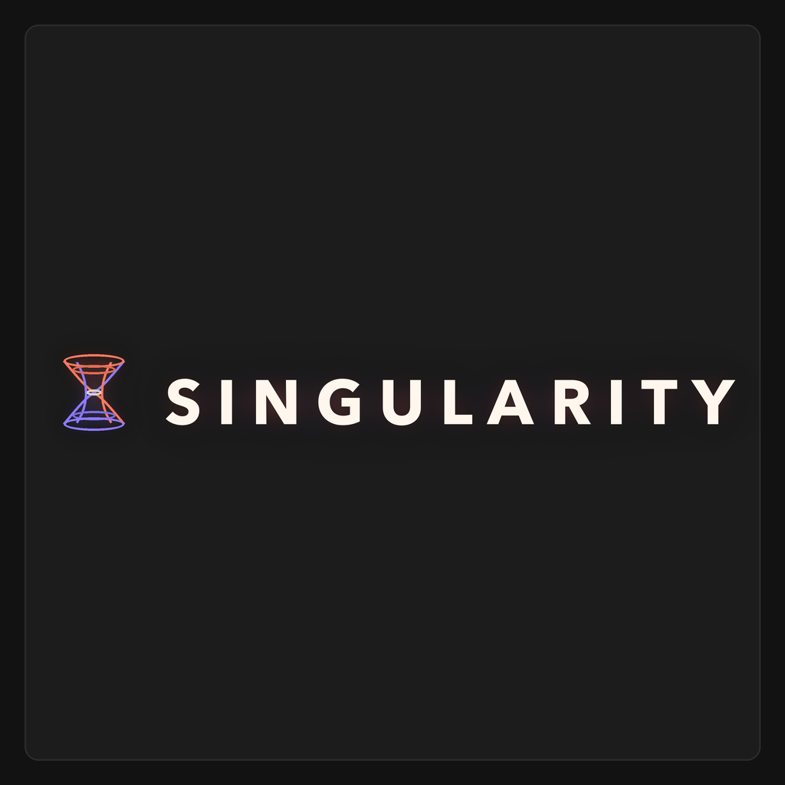

# Singularity



Singularity is a crypto-native mission funding platform for launching mission markets, selling mission tokens, governing treasury allocations, and funding builders through council approval.

The repository is organized as a production-oriented monorepo: a cinematic WebGL landing page, a Next.js platform app, shared UI and backend packages, an indexer, and Solana programs for mission registry and treasury council rules.

## Highlights

- **Mission markets** for launching goal-driven communities with their own mission token.
- **Treasury allocation** with 20% of mission token supply reserved for the mission treasury.
- **Council governance** where the top six registered mission-token holders can approve funding requests.
- **Funding requests** that move through on-chain voting, acceptance, and delayed execution.
- **Hybrid backend** that keeps canonical financial state on Solana while indexing fast app reads into Postgres.
- **Cinematic interface** built around the Singularity hourglass/orbit visual language.

## Repository Layout

```text
.
|-- apps
|   |-- app                 # Next.js platform app for app.singularity.diy
|   |-- landing             # Vite + Three.js landing page for singularity.diy
|   `-- indexer             # App-level indexer package entry point
|-- packages
|   |-- db                  # Database package
|   |-- indexer             # Shared indexer core
|   |-- solana              # Solana client helpers and transaction builders
|   |-- storage             # Upload/storage boundary
|   `-- ui                  # Shared brand primitives and UI components
|-- programs
|   |-- singularity_registry
|   `-- singularity_council
|-- tests                   # Anchor tests
|-- docs                    # Supporting documentation and README assets
|-- BACKEND_SPECIFICATION.md
|-- PROGRAM_DOCUMENTATION.md
`-- UI_SPECIFICATION.md
```

## Architecture

Singularity uses a hybrid architecture:

- The **landing app** presents the brand and product narrative through a real-time WebGL scene.
- The **platform app** exposes missions, markets, profiles, council flows, funding requests, and wallet-authenticated actions.
- The **backend API** prepares transactions, serves indexed reads, manages sessions, and stores editable metadata.
- The **indexer** watches Solana state and denormalizes mission, council, request, balance, and market data for fast UI rendering.
- The **Solana programs** enforce mission registry and treasury council invariants.

## Product Model

Core objects:

- `Mission`: goal, token, market, treasury, council, and funding feed.
- `Mission token`: the tradable token attached to a mission.
- `Treasury`: 20% of mission token supply reserved for builder funding.
- `Treasury council`: six registered mission-token holders selected for an epoch.
- `Funding request`: proposal to receive mission-token treasury funds.
- `Profile`: wallet-based identity with balances, roles, created missions, and request history.

The MVP defaults to Token-2022 mission tokens, USDC-denominated market pricing, Meteora Dynamic Bonding Curve for launch markets, and Meteora DAMM for graduated liquidity.

## Stack

- **Monorepo:** npm workspaces, Turborepo, TypeScript
- **Landing:** React, Vite, Three.js, React Three Fiber, GSAP
- **Platform:** Next.js App Router, React, Motion, Recharts
- **Auth:** Wallet authentication with Privy support
- **Backend:** Next.js route handlers, Postgres, storage package boundary
- **Solana:** Anchor, `@solana/web3.js`, Token Program clients
- **Programs:** Rust Anchor programs for registry and council governance

## Getting Started

### Prerequisites

- Node.js 20 or newer
- npm 10 or newer
- A Solana RPC endpoint
- Postgres if running the persistent backend store
- Anchor toolchain for Solana program tests

### Install

```bash
npm install
```

### Configure Environment

Copy the example environment file and fill in the values required for the app mode you want to run:

```bash
cp .env.example apps/app/.env.local
```

Important variables include:

- `DATABASE_URL` and `DATABASE_SSL` for Postgres-backed app state.
- `SINGULARITY_STORAGE` to choose the storage backend.
- `SINGULARITY_SESSION_SECRET` for signed sessions.
- `SOLANA_RPC_URL` and `NEXT_PUBLIC_SOLANA_RPC_URL` for chain access.
- `NEXT_PUBLIC_PRIVY_APP_ID`, `PRIVY_APP_SECRET`, and optional `PRIVY_JWT_VERIFICATION_KEY` for Privy auth.
- `SINGULARITY_REGISTRY_PROGRAM_ID` and `SINGULARITY_COUNCIL_PROGRAM_ID` for deployed program addresses.

## Development

Run the platform app:

```bash
npm run dev:app
```

Open:

```text
http://127.0.0.1:8094
```

Run the landing page:

```bash
npm run dev:landing
```

Open:

```text
http://127.0.0.1:8092
```

Build everything:

```bash
npm run build
```

Type-check every workspace:

```bash
npm run typecheck
```

Run database migrations:

```bash
npm run db:migrate
```

Run the security gate:

```bash
npm run security:gate
```

Run Anchor tests:

```bash
npm run test:anchor
```

For local Anchor test orchestration:

```bash
npm run test:anchor:local
```

## Solana Programs

`singularity_registry` creates and tracks missions. It stores mission metadata hash, token mint, treasury vault, total supply, treasury allocation, lifecycle, and graduation pool information.

`singularity_council` manages candidate registration, epoch council finalization, funding request creation, council voting, escrowed voting tokens, and treasury execution after the required voting period.

High-level flow:

1. A creator initializes a mission in the registry program.
2. Mission-token holders register as council candidates.
3. The council authority finalizes the six-member epoch council.
4. Builders create funding requests for mission-token treasury funds.
5. Council members vote and escrow their required voting tokens.
6. Four approvals accept a request; three rejections reject it.
7. Accepted requests become executable after the three-day minimum voting period.
8. The mission can later graduate from bonding to a DAMM pool.

## Documentation

- `UI_SPECIFICATION.md` defines product positioning, visual language, and platform screens.
- `BACKEND_SPECIFICATION.md` defines the backend, indexer, storage, and Solana architecture.
- `PROGRAM_DOCUMENTATION.md` explains the Anchor programs and their account model.
- `docs/security/launch-audit-gates.md` captures launch security checks.

## Status

This codebase is an active product build. The platform app includes local mock flows and backend boundaries, while the Solana programs, transaction routes, indexer, and storage packages are being shaped toward a production launch path.
